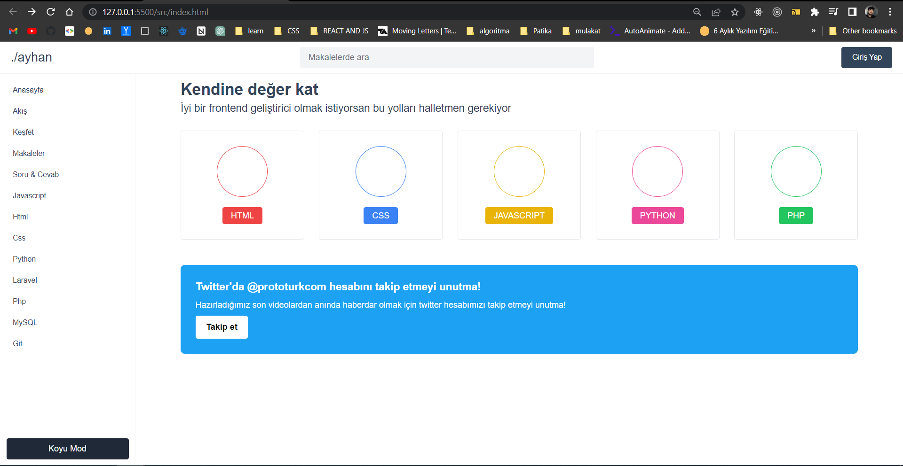

# Tailwind Css

### Bu projemde tailwind css , detaylı şekilde öğrenmek ve öğretmek istediğim için böyle bir deneyim sunmak istedim .

### Tailwindcss Başlama

### Tailwind CSS'yi yükleyin

### npm aracılığıyla kurun tailwindcssve dosyanızı oluşturun tailwind.config.js .

```js
npm install -D tailwindcss
npx tailwindcss init
```

### Şablon yollarınızı yapılandırın

### Dosyanızdaki tüm şablon dosyalarınızın yollarını ekleyin tailwind.config.js.

```js
/** @type {import('tailwindcss').Config} */
module.exports = {
  content: ["./src/**/*.{html,js}"],
  theme: {
    extend: {},
  },
  plugins: [],
};
```

### Tailwind yönergelerini CSS'nize ekleyin

### @tailwindTailwind'in katmanlarının her biri için yönergeleri ana CSS dosyanıza ekleyin .

```js
@tailwind base;
@tailwind components;
@tailwind utilities;
```

### Tailwind CLI oluşturma sürecini başlatın

### Sınıflar için şablon dosyalarınızı taramak ve CSS'nizi oluşturmak için CLI aracını çalıştırın.

```jsx
npx tailwindcss -i ./src/style.css -o ./dist/output.css --watch
```

### veya şu şekilde yapabilirsiniz , package.json dosyasına gidin ve şu kodları ait olduğu yere yapıştırın

```js
  "scripts": {
    "start": "npx tailwindcss -i ./src/style.css -o ./dist/output.css --watch"
  },
```

### Tailwind'i HTML'nizde kullanmaya başlayın

### Derlenmiş CSS dosyanızı şuraya ekleyin <head>ve içeriğinize stil vermek için Tailwind'in yardımcı program sınıflarını kullanmaya başlayın.

```html
<!DOCTYPE html>
<html>
  <head>
    <meta charset="UTF-8" />
    <meta name="viewport" content="width=device-width, initial-scale=1.0" />
    <link href="/dist/output.css" rel="stylesheet" />
  </head>
  <body>
    <h1 class="text-3xl font-bold underline">Hello world!</h1>
  </body>
</html>
```

### Kendi özel css kod getirmek isterseniz yapacağınız tek şey "tailwind.config.js dosyasına gidip aynen şu şekilde yazmanızdır"

```jsx
/** @type {import('tailwindcss').Config} */
module.exports = {
  content: ["./src/**/*.{html,js}"],
  theme: {
    extend: {
      colors: {
        logo: "#32445a",
      },
      spacing: {
        15: "3.75rem",
      },
    },
  },
  plugins: [],
};
```

### Uygulamanın ilk kısmı bitti , şimdi ikinci kısmına başlıyalım


